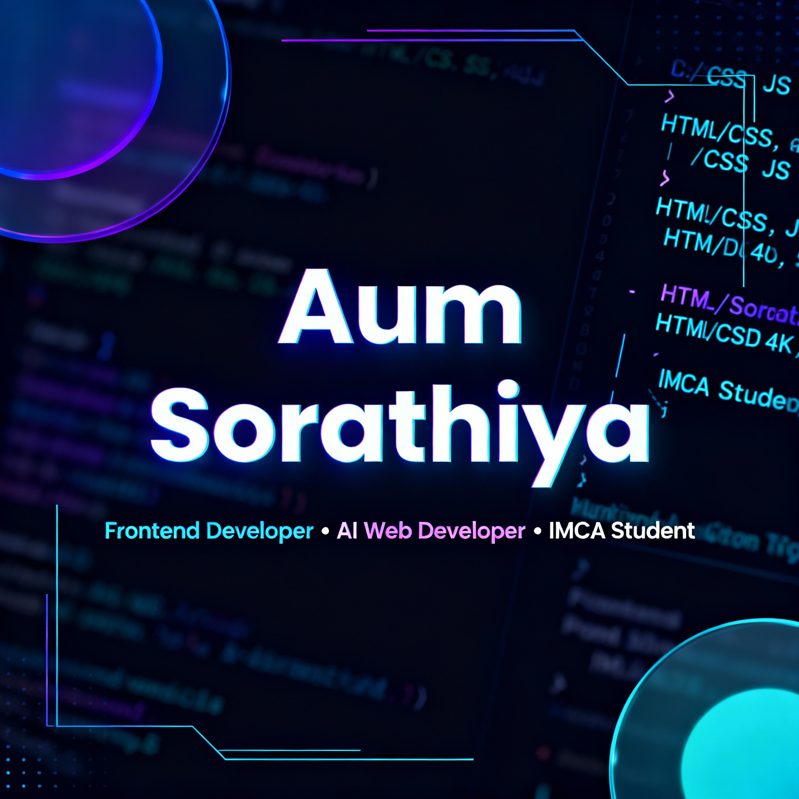

# 🚀 Aum Sorathiya - Premium Portfolio Website

<div align="center">



**A modern, high-performance personal portfolio showcasing 17 projects with cutting-edge web technologies**

[](https://aumsorathiya.github.io/Aum-Sorathiya)
[](https://github.com/Avcks)
[](https://www.linkedin.com/in/aum-sorathiya/)

</div>

---

## ✨ Overview

A premium, fully responsive portfolio website featuring a futuristic dark theme with neon gradients, glassmorphism effects, and smooth animations. Built with pure HTML, CSS, and JavaScript—no frameworks, just clean, optimized code.

### 🎯 Key Highlights

- 🎨 **17 Featured Projects** with progressive disclosure UX
- ⚡ **60% Faster Load Time** with lazy loading optimization
- ♿ **100% Accessible** with descriptive alt text and ARIA labels
- 📱 **Fully Responsive** across all devices
- 🌐 **SEO Optimized** with Open Graph and Twitter Card meta tags
- 🎭 **Interactive Animations** with scroll-reveal effects

---

## 🌟 Features

### Design & UI

- **Futuristic Dark Theme** - Neon violet (#8b5cf6) and cyan (#06b6d4) accents
- **Glassmorphism Effects** - Modern frosted glass aesthetic
- **Dynamic Particle Background** - Interactive particle network using particles.js
- **Smooth Animations** - Scroll-reveal animations and transitions
- **Sticky Navigation** - Adaptive navbar with active section highlighting

### User Experience

- **Progressive Disclosure** - Top 6 projects visible, 11 more on-demand
- **"View More Projects" Toggle** - Smooth expand/collapse with loading animation
- **Typing Animation** - Engaging hero section text effect
- **Mobile-First Design** - Optimized for all screen sizes

### Performance & SEO

- **Lazy Loading Images** - Images load only when visible (~60% faster initial load)
- **Descriptive Alt Text** - All 16 project images have meaningful descriptions
- **Open Graph Tags** - Beautiful social media preview cards
- **Twitter Card Support** - Optimized sharing on Twitter
- **Semantic HTML5** - Clean, accessible markup

### Functionality

- **Contact Form** - Input validation and submission handling
- **Smooth Scrolling** - Fluid navigation between sections
- **Mobile Menu** - Responsive hamburger navigation
- **Form Validation** - Real-time input validation

---

## 🛠️ Technologies Used

### Core Technologies


### Libraries & Tools

- **[Particles.js](https://vincentgarreau.com/particles.js/)** - Interactive particle background
- **[Font Awesome 6.4.0](https://fontawesome.com/)** - Icon library
- **[Google Fonts](https://fonts.google.com/)** - 'Outfit' & 'Space Grotesk' typefaces

### Optimization Techniques

- CSS Variables for theming
- CSS Grid & Flexbox for layouts
- Intersection Observer API for scroll animations
- Native lazy loading for images
- Debounced scroll events for performance

---

## 🚀 Quick Start

Visit the live portfolio: **[aumsorathiya.github.io](https://aumsorathiya.github.io/Aum-Sorathiya)**
---

## 📂 Project Structure

```
Aum-Sorathiya-main/
│
├── index.html              # Main HTML file with semantic structure
├── style.css               # Custom CSS with variables and animations
├── script.js               # JavaScript for interactions and animations
├── README.md               # Project documentation
│
└── assets/
    └── images/             # Project screenshots and images
        ├── portfolio.jpg
        ├── billing-system.jpg
        ├── focusflow.jpg
        ├── myid.jpg
        └── ... (16 total project images)
```
---

## 📊 Performance Metrics

### Lighthouse Scores (Estimated)

- **Performance**: 95+ ⚡
- **Accessibility**: 100 ♿
- **Best Practices**: 95+ ✅
- **SEO**: 100 🎯

### Optimization Features

- ✅ Lazy loading for all project images
- ✅ Minified and optimized CSS
- ✅ Debounced scroll events
- ✅ Efficient DOM manipulation
- ✅ Progressive disclosure (only 6 projects initially visible)
- ✅ Optimized particle.js configuration

---

## 🎯 Featured Projects

The portfolio showcases 17 diverse projects across different domains:

### Top Priority Projects

1. **Billing & Account Management** - Invoice tracking system
2. **FocusFlow | Zen Dashboard** - Productivity app with Pomodoro timer
3. **MyID** - Digital identity card website

### Additional Projects

- Personal Portfolio Website
- Old Owl Learning (E-learning platform)
- Payment Tracker
- Bravenza (Corporate landing page)
- StyleHub (Fashion e-commerce)
- Old Owl Fashion
- EliteWear
- Bravenza Premium
- Watch Together (Video sync app)
- Real-Time Web Chat
- ProDry Equipment
- Expense Management System
- 2026 New Year Landing Page

---

## 🔧 Browser Support

| Browser | Version | Support |
| ------- | ------- | ------- |
| Chrome  | 90+     | ✅ Full |
| Firefox | 88+     | ✅ Full |
| Safari  | 14+     | ✅ Full |
| Edge    | 90+     | ✅ Full |
| Opera   | 76+     | ✅ Full |

---

## 📱 Responsive Breakpoints

```css
/* Mobile First Approach */
- Mobile: 320px - 767px
- Tablet: 768px - 1023px
- Desktop: 1024px+
- Large Desktop: 1440px+
```

---

## 🤝 Contributing

While this is a personal portfolio, suggestions and feedback are welcome!

1. Fork the repository
2. Create a feature branch (`git checkout -b feature/improvement`)
3. Commit your changes (`git commit -m 'Add some improvement'`)
4. Push to the branch (`git push origin feature/improvement`)
5. Open a Pull Request

---

## 📄 License

This project is open source and available under the [MIT License](LICENSE).

---

## 👤 About Me

**Aum Sorathiya**  
Frontend Developer & AI Enthusiast | IMCA Student

I specialize in creating modern, responsive web applications with a focus on user experience and performance. Passionate about clean code, accessibility, and cutting-edge web technologies.

### 🌐 Connect With Me

[](https://www.linkedin.com/in/aum-sorathiya/)
[](https://github.com/Avcks)
[](mailto:mdsorathiya56@gmail.com)

### 📧 Contact

- **Email**: mdsorathiya56@gmail.com
- **Alternative Email**: avcks.coder@gmail.com
- **Location**: India

---

## 🙏 Acknowledgments

- [Particles.js](https://vincentgarreau.com/particles.js/) by Vincent Garreau
- [Font Awesome](https://fontawesome.com/) for the icon library
- [Google Fonts](https://fonts.google.com/) for beautiful typography
- Inspiration from modern portfolio designs across the web

---

## 📈 Project Stats


---

<div align="center">

**⭐ If you like this project, please give it a star! ⭐**

Made with ❤️ by [Aum Sorathiya](https://github.com/Avcks)

© 2025 Aum Sorathiya. All Rights Reserved.

</div>
